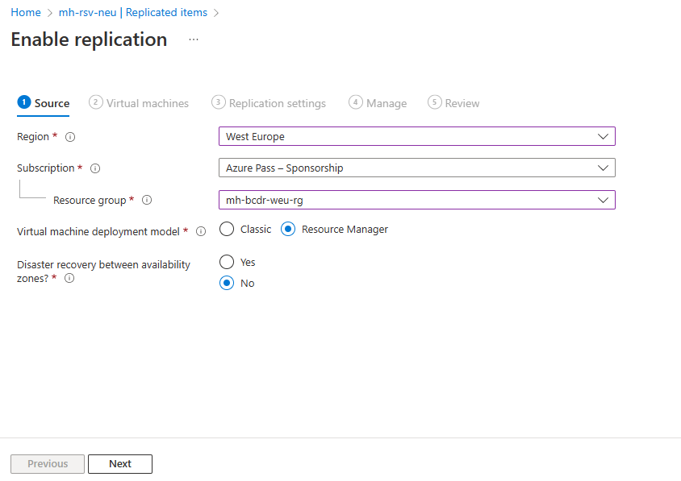
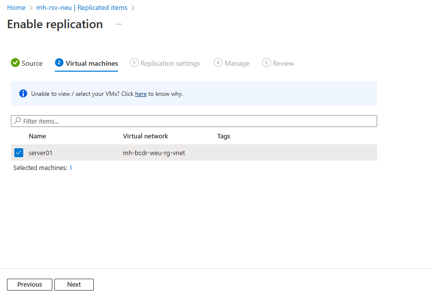
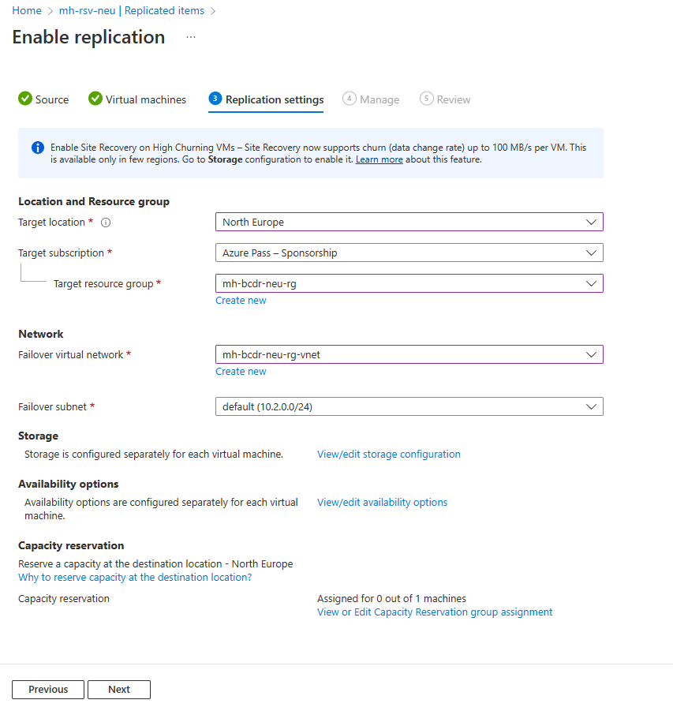
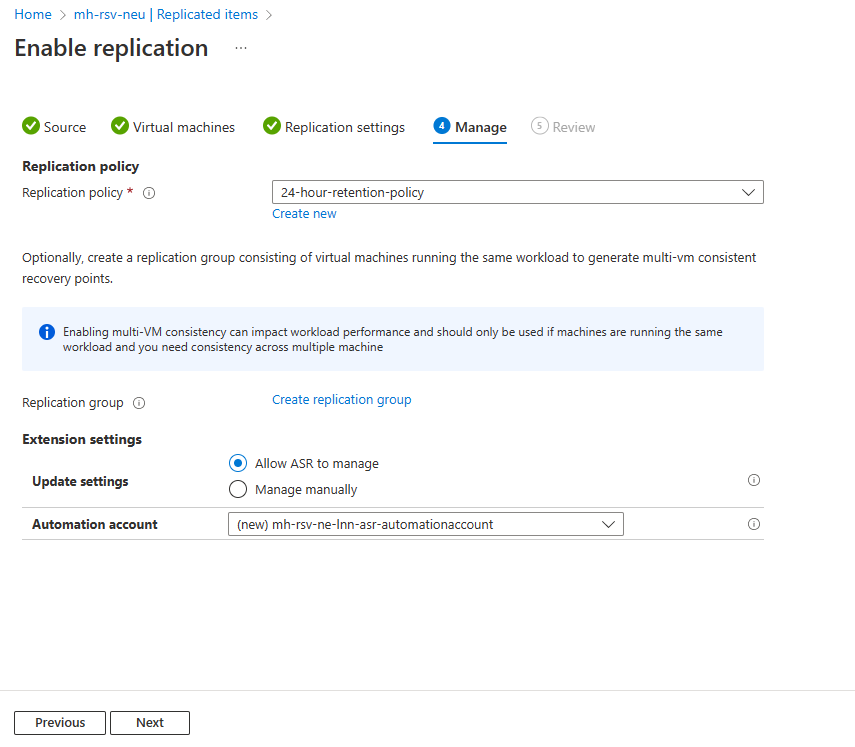
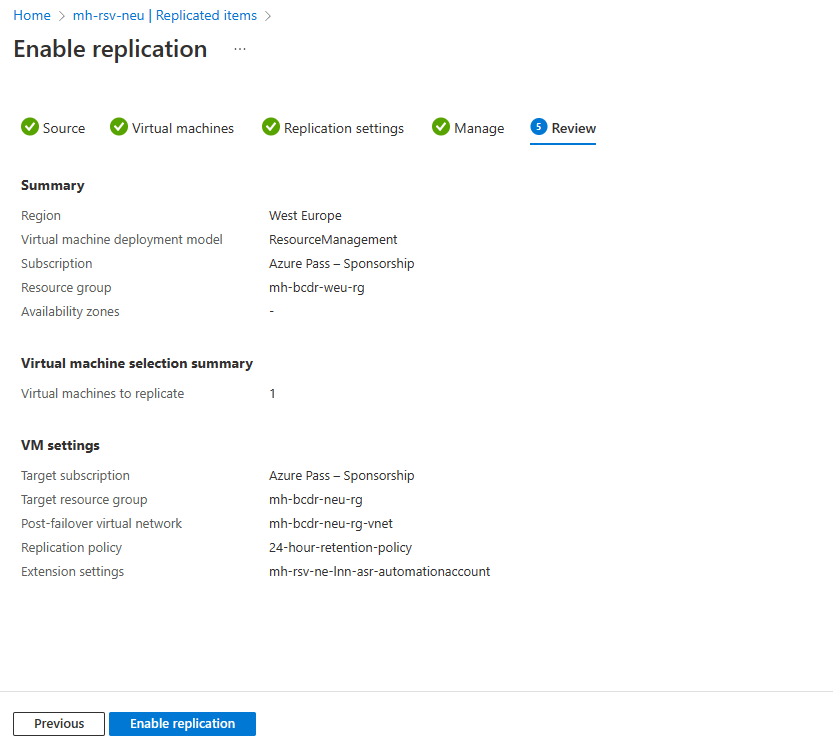
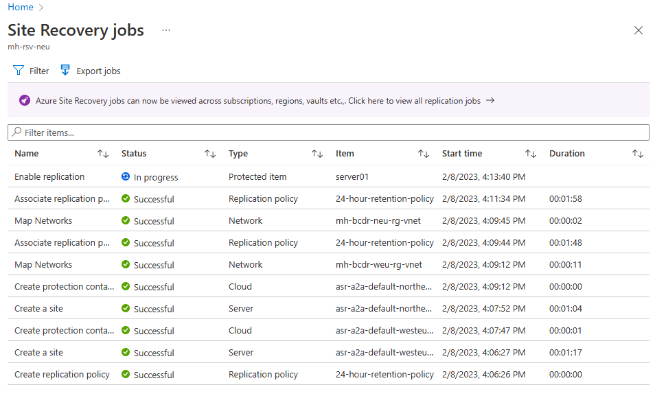
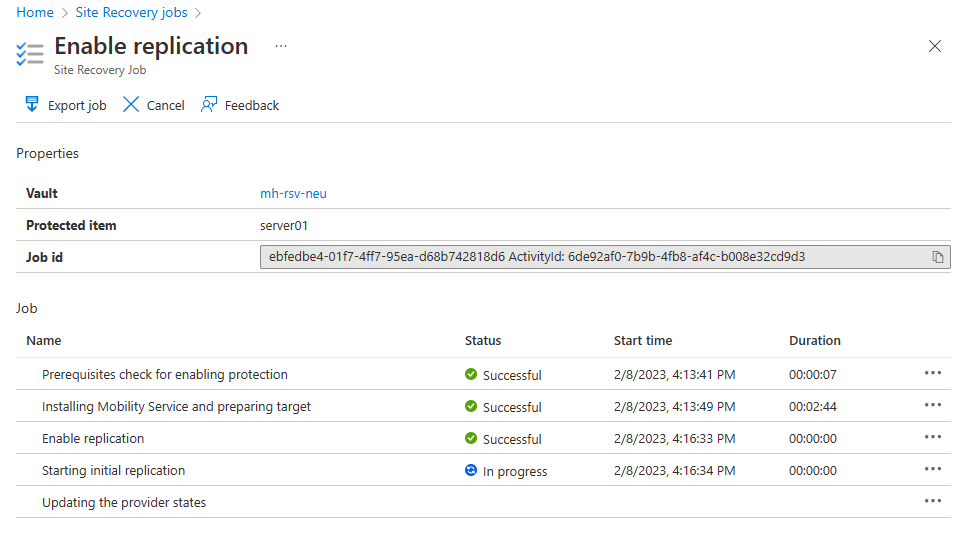
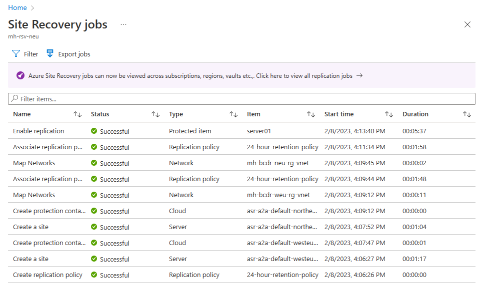

# Walkthrough Challenge 3 - Access Azure resources using Managed Identities from your on-premises servers

Duration: 30 minutes

[Previous Challenge Solution](../challenge-2/solution.md) - **[Home](../../Readme.md)** - [Next Challenge Solution](../challenge-4/solution.md)

## Prerequisites

Please ensure that you successfully passed [challenge 2](../../Readme.md#challenge-2) before continuing with this challenge.

In this Challenge, you will learn how to protect Azure VM with Azure Site Recovery, and enable replication to the secondary site. Moreover, you will successfully run the test failover and failback to make sure the solution works as expected.

### Actions

* Set up and enable disaster recovery with Azure Site Recovery and monitor the progress
* Performing a disaster recovery drill, creating recovery plan and test failover 
* Failback to the Europe West region (Source environment) and monitor the progress

### Task 1: Enable replication with Azure Site recovery for the Virtual Machine in the West Europe Region to the North Europe Region

Navigate to Recovery Services Vault in the North Europe (mh-rsv-neu) which we created in the first Challenge. In the Protected Items, select Replicated Items. Then select Replicate and from the dropdown list select Azure virtual machines. The following pan will apprear:

In the deployment notification you could navigate to the Site Recovery Jobs which lists all Site Recovery Actions you have created in this task.

You can select in progress jobs to check the status and progress.

This Task can take up to 10 minutes to finish.

You successfully completed challenge 3! 🚀🚀🚀
