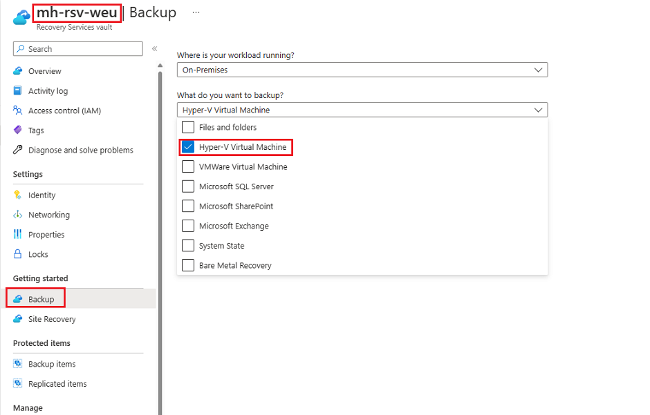
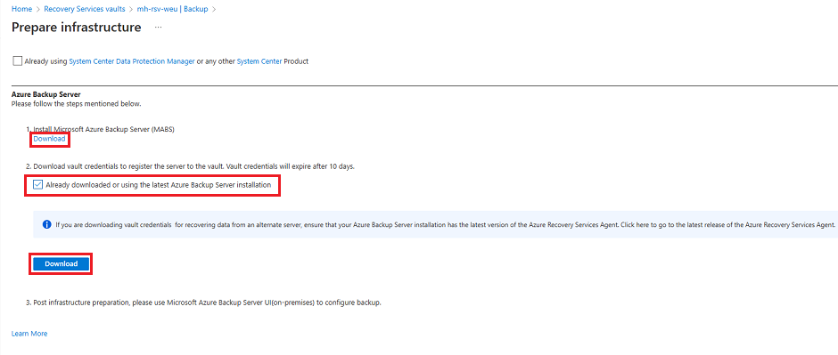
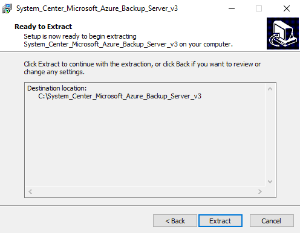
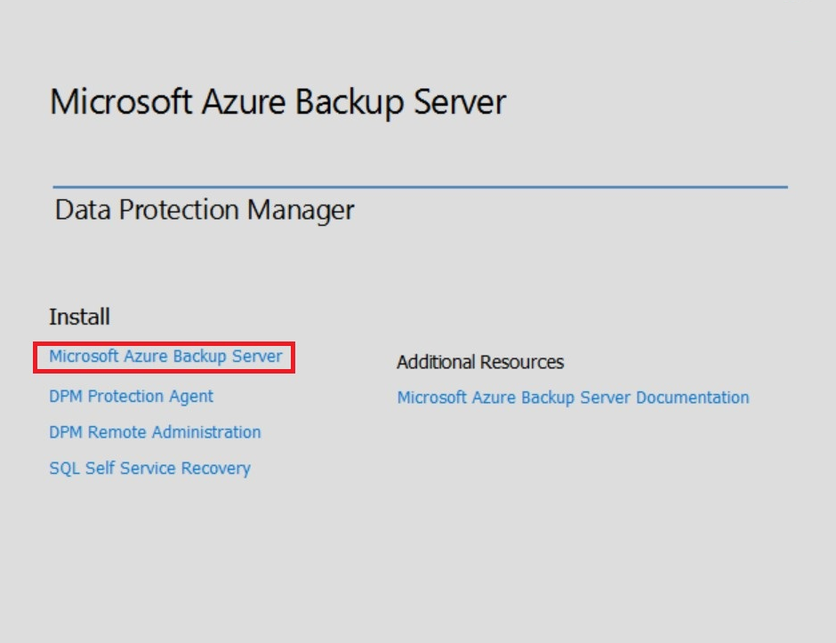
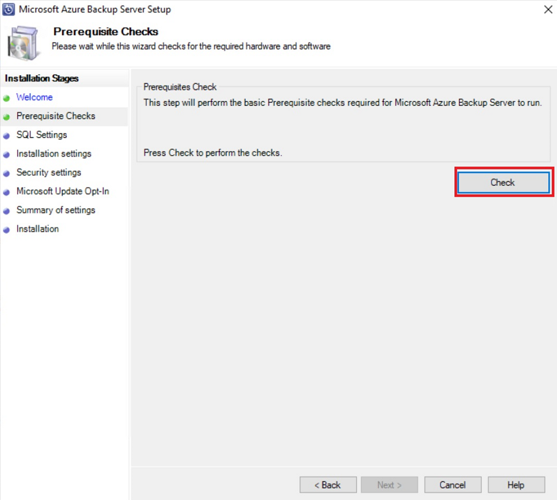
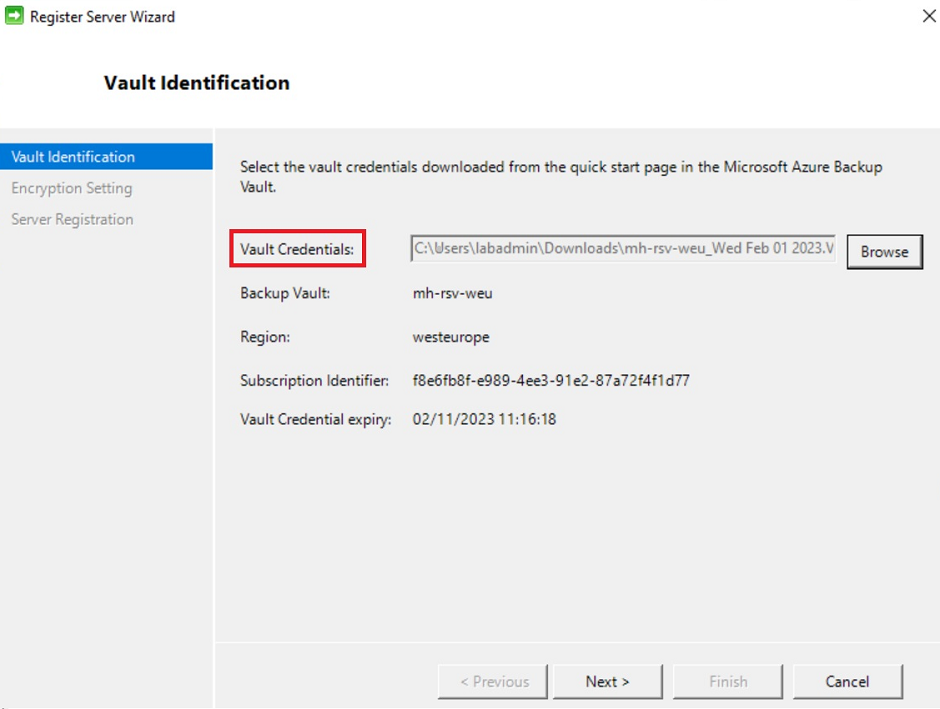
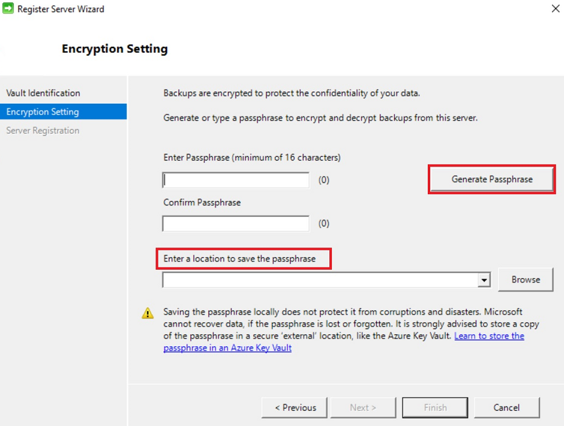
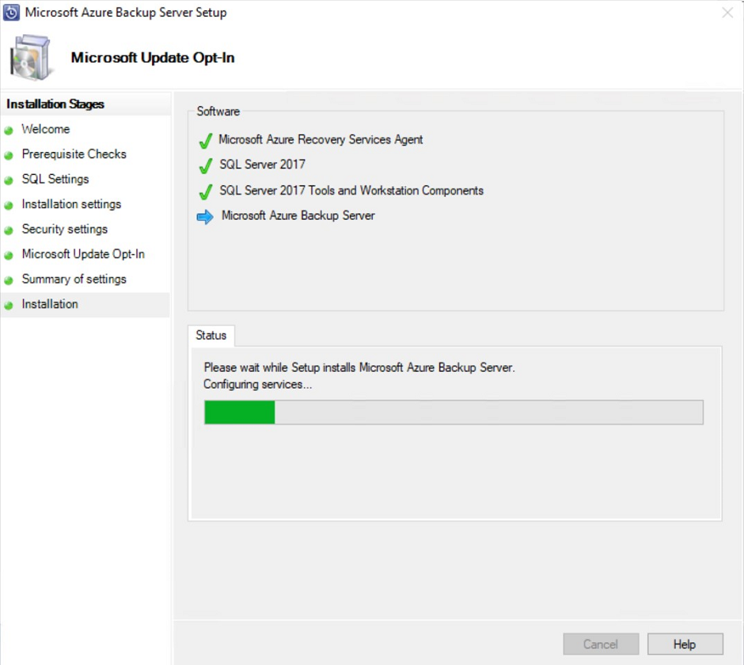

# Walkthrough Challenge 4 - Microsoft Defender for Cloud integration with Azure Arc

Duration: 30 minutes

[Previous Challenge Solution](../challenge-3/solution.md) - **[Home](../../Readme.md)** - [Next Challenge Solution](../challenge-5/solution.md)

## Prerequisites

Please ensure that you successfully passed [challenge 3](../../Readme.md#challenge-3) before continuing with this challenge.

In this challenge you will learn how to protect your on-premise Hyper-V virtual machines with Microsoft Azure Backup Server (MABS). For this MicroHack, we are using Nested Virtualization (Windows server with Hyper-V role) in Azure as an emulation of the on-Premise environment (server Name: cmhost).

Actions:

* Install the Microsoft Azure Backup Server (MABS) in the on-premise infrastructure
* Add a Backup Storage to the MABS disk storage
* Register an on-premise Windows server (Windows server 2016) to the MABS
* Protect the registered VM with MABS
* Register the on-premise Hyper-V host to the MABS
* Protect two Hyper-V's VMs with MABS
* Recover a VM using the recovered vhdx from MABS

### Task 1: Install the Microsoft Azure Backup Server (MABS)

### Download the MABS

As a first step, we will Download the Microsoft Azure Backup Server (MABS) from the Azure Recovery Services Vault that we created in [challenge 1](../../Readme.md#challenge-1). 

To protect on-premises workloads, the MABS server **must be located on-premises**, and **connected to a domain**. You can run the server on a Hyper-V VM, a VMware VM, or a physical host. The recommended minimum requirements for the server hardware are two cores and 8-GB RAM. The supported operating systems are:

* Windows Server 2019 (Standard, Datacenter, Essentials) - 64 bit
* Windows Server 2016 and latest SPs (Standard, Datacenter, Essentials) - 64 bit

We will download and install the MABS in a Windows Server 2016 located in the Hyper-v server and joined to "contosomortgage.local" domain (cmMABS). 

* Form the server 2016 navigate to **Recovery Services Vault** in the West Europe (mh-rsv-weu) which we created in the first Challenge. Under **Backup**, select **On-Premises** and **Hyper-V Virtual Machine** and **Prepare Infrastructure**. 

* In the Prepare infrastructure pane, select the **Download links for Install Azure Backup Server** and **Download vault credentials** (You will use the vault credentials during registration of Azure Backup Server to the Recovery Services vault).

* **Download** the Microsoft Azure Backup Server (MABS), select all the files and **Download all the files** coming in from the Microsoft Azure Backup download page, and place all the files in the same folder.

### Install the Azure Backup Server

* The MABS server must be domain joined and have .NET 3.51 installed. The installer will add .NET 4 during the installation if it’s not present. After you've downloaded all the files, run **System_Center_Microsoft_Azure_Backup_Server_v3.exe**. Select the **Extract** button and then select **Microsoft Azure Backup** to launch the setup wizard.

* Once the extraction process complete, check the box to launch the freshly extracted setup.exe to begin installing Microsoft Azure Backup Server and select the Finish button.

Check the Prerequisite to determine if the hardware and software prerequisites for Azure Backup Server have been met.

* The Azure Backup Server installation package comes bundled with the appropriate SQL Server binaries needed. Select the option **Install new Instance of SQL Server with this Setup** and select the Check and Install button. 

If you wish to use your own SQL server, the supported SQL Server versions are SQL Server 2014 SP1 or higher, 2016 and 2017. All SQL Server versions should be Standard or Enterprise 64-bit. Azure Backup Server won't work with a remote SQL Server instance. The instance being used by Azure Backup Server needs to be local. If you're using an existing SQL server for MABS, the MABS setup only supports the use of named instances of SQL server.

Provide a strong password for restricted local user accounts and select Next.

The installation happens in **phases**:

#### First Phase

The Microsoft Azure Recovery Services Agent is installed on the server. The wizard also checks for Internet connectivity. If Internet connectivity is available, you can continue with the installation. If not, you need to provide proxy details to connect to the Internet.

#### Second Phase

The next step is to configure the Microsoft Azure Recovery Services Agent. As a part of the configuration, you'll have to provide your vault credentials to register the machine to the Recovery Services vault. You'll also provide a passphrase to encrypt/decrypt the data sent between Azure and your premises. You can automatically generate a passphrase or provide your own minimum 16-character passphrase. Continue with the wizard until the agent has been configured.

#### Last Phase

Once registration of the Microsoft Azure Backup server successfully completes, the overall setup wizard proceeds to the installation and configuration of SQL Server and the Azure Backup Server components. Once the SQL Server component installation completes, the Azure Backup Server components are installed.

### Task 2: Add a Backup Storage to the Microsoft Azure Backup Server disk storage

### Create a volume on a virtual disk in a storage pool

Congratulations! You secured any server which is outside of Azure and onboarded via Azure Arc.

You successfully completed challenge 4! 🚀🚀🚀

